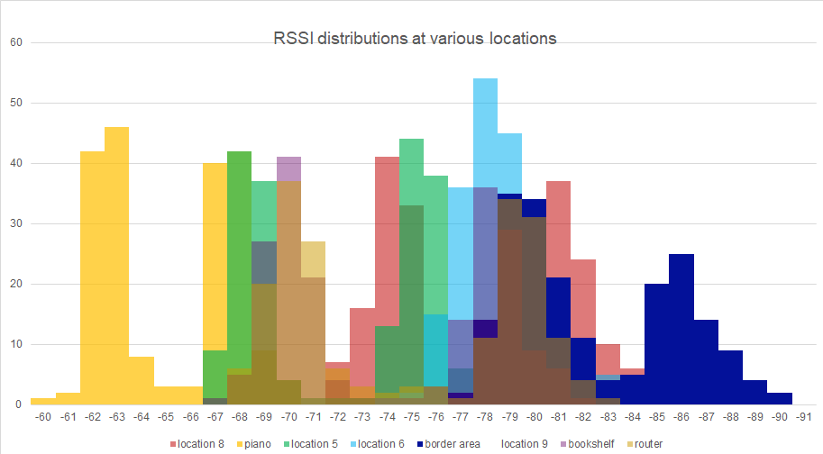
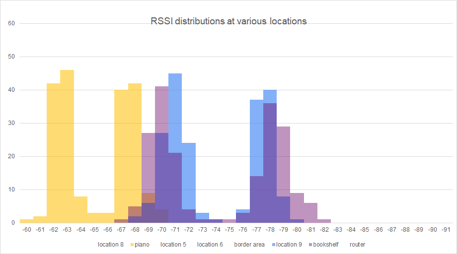
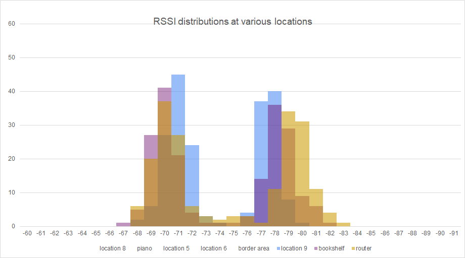
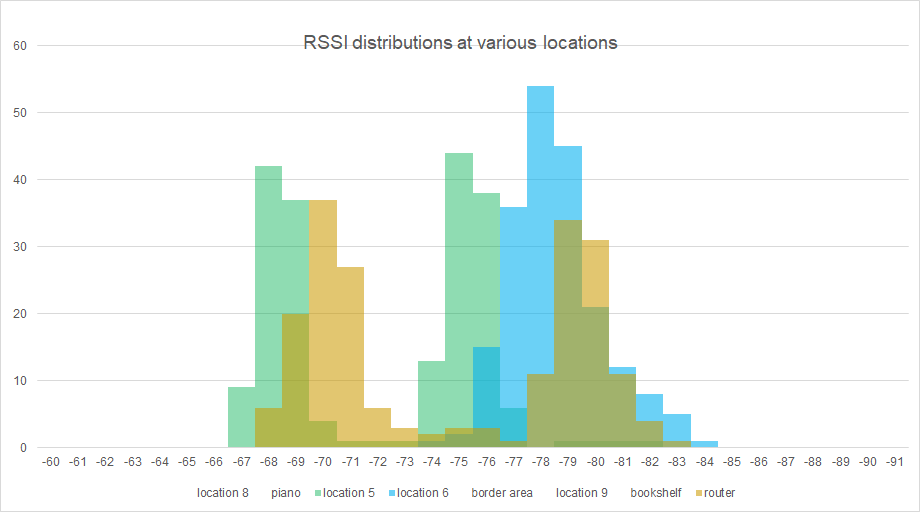
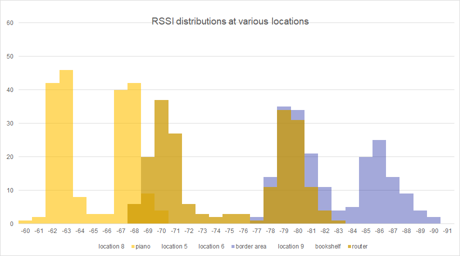

## The need for AirTag alternatives
When Apple released their AirTag trackers in 2021, I was initially quite excited for many reasons. For example, I could 
track my bike more easily, (see this blog post about 
the app I wrote to automatically note down my bike parking location) and cease worrying about losing jackets.

My excitement was quickly crushed after a Google search
revealed that AirTags were not compatible with Android phones.
I wasn't about to sacrifice my sparkling, brand-new Pixel phone, and while there are existing AirTag equivalents such as Tile,
they didn't work nearly as well. 
There's a simple reason for this, and it's not 
because AirTags are engineered better. 

Rather, it has to do with the fact that everyone with an iPhone is forced to participate in the process of locating a lost AirTag. You see, trackers like AirTags and Tiles work by pinging nearby smartphones.
These phones then phone home to Apple's and Tile's respective servers, who in turn make this location data
available to the owner of the tracker. 
Thus, as long as a participating phone is physically near the tracker, the tracker's owner can infer the location of the tracker from the location of the nearby phone.
Anyone with an iPhone participates in this system, whether they want to or not. AirTags work so well
because there are just so many iPhones scattered 
around the world that there will almost always be at 
least one iPhone near one's AirTag. 

In contrast,
the only participating phones in Tile's similar network are those of other Tile owner. This network
is much smaller: In the entire Santa Barbara area,
there are only about 1,500 Tile owners.

So I did what any reasonable, self-respecting, and normal person would do in my situation: 
I set out to design and build my own physical location tracker that would work with Android phones and avoid the issues
associated with Tile. Come join me on this adventure!

## Wifi Fingerprinting
There are many localization strategies (aka strategies for calculating a tracker's localization), but
localization using Wifi, made the most sense.
Unlike GPS, Wifi localization can be used anywhere where you can get a Wifi connection,
including in indoor spaces where GPS performs poorly. 
While localization strategies using cellular networks work consistently indoors and out, their accuracy 
is in the order of dozens of meters in the best of circumstances.

Thus, I settled on a Wifi based localization strategy known as Wifi fingerprinting.
Wifi fingerprinting works in two steps.
First, a Wifi map is created.
To create this map, the signal strengths of available routers, are measured at a variety of 
locations.
These signal strengths are referred to as RSSIs, short for Received Signal Strength Indicator.
Then, when a device wants to locate itself, all it has to do is to observe RSSIs of nearby router and compare them
to the previously created Wifi map. 
If one creates a detailed Wifi map, this comparison process is simple.
For example, if the map has RSSI data for every square foot of a single story building, the tracker can infer its location within an accuracy of 1 square meter by simply selecting the map data point with RSSI values closest to the observed values.

I'm not going to be able to create such a detailed map.
Ideally, I'd want Pear Tags to work on the entirety of UC Santa Barbara campus.
It'd be impossible for me to create such detailed measurements for such a large campus.
Thus, my implementation of Wifi localization would require interpolating the tracker's location from 
Wifi map checkpoints that are 10's of meters apart.
Existing implementation for such interpolation are quite sophisticated, especially ones that 
utilize support vector machines. 

## Creating a simple proof of concept
Before rushing along to create a complicated algorithm that may ultimately fail, I wanted to 
first create a proof of concept. 
In particular, I wanted to able to measure RSSI's in several different location in my home,
and see there there is enough data to clearly differentiate one location from another.
After all, in order for this adventure to succeed, it must be able to differentiate between my living room
and my kitchen.

Thus, I set about placing my laptop in various parts of my house, collecting 2 minutes worth of RSSI data
to account for RSSI noise.
Blog post about the scripting necessary to achieve this task coming soon. 
Below is a crude drawing I made of several rooms in my house:

And here are my measurements of RSSIs from my neighbor's wifi
at various locations! 

Tada!
Let's select just a few locations to compare at the same time so we're not so overwhelmed with data.
Here is the distribution of RSSI's at the bookshelf, the piano, and location 9 (the kitchen)

From this we have some good news and some bad news.
For the good news, the RSSI distribution is clearly
different near the piano than in the kitchen and 
near the bookshelf. 
Thus, just by looking at my neighbor's wifi's
RSSI distribution, I can differentiate between
the piano location and the kitchen

For the bad news, we see that the kitchen and
bookshelf RSSI distribution are almost identical,
despite being several meters away from each other
and in different rooms. Using my neighbor's wifi
is not enough to differentiate between the bookshelf
location and the oven location.
This is also the case for the location of
my home router:

The RSSI distributions are slightly different 
for location 5 and 6, but not enough to inspire
confidence:

There are really only 3 clearly distinct RSSI distributions: the router distribution groups, the piano group,
and the area 5/border area distribution:

Let's see if we can differentiate within the router group using my own network,
which is cleverly named PBIB10112408:

Wow! we have perfect separation! 
Now let's include the distributions in the router group that were partially distinct
from the router distribution:
